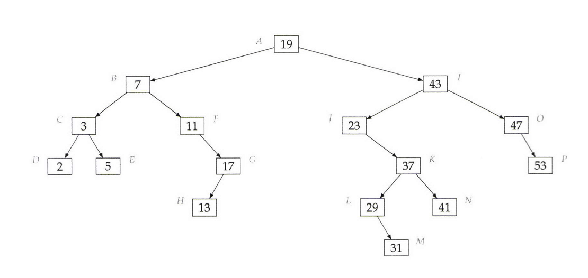

# Test If Three BST Nodes Are Totally Ordered

 

Write a program which takes two nodes in a BST and a third node, the "middle" node, and determines if one of the two nodes is a proper ancestor and the other a proper descendant of the
middle. (A proper ancestor of a node is an ancestor that is not equal to the node; a proper descendant is defined similarly.) 
You can assurne that all keys are unique. Nodes do not have pointers to their parents

 

- Hint: For what specific arrangements of the three nodes does the check pass?

 

### Examples 
In Figure below
- if the middle is Node J, your function should return true if the two nodes are {A,K} or {I, M}. 
- if the middle is Node J, your function should return false if the two nodes are {I, P} or {J, K}. 

