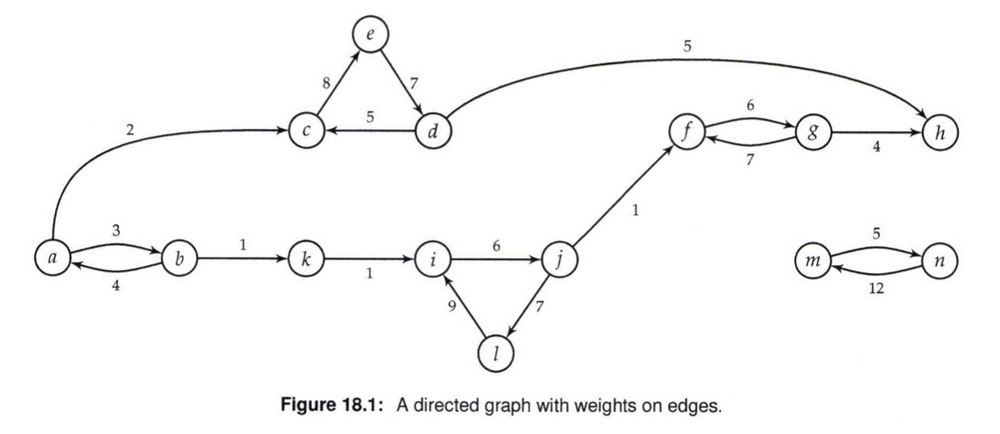
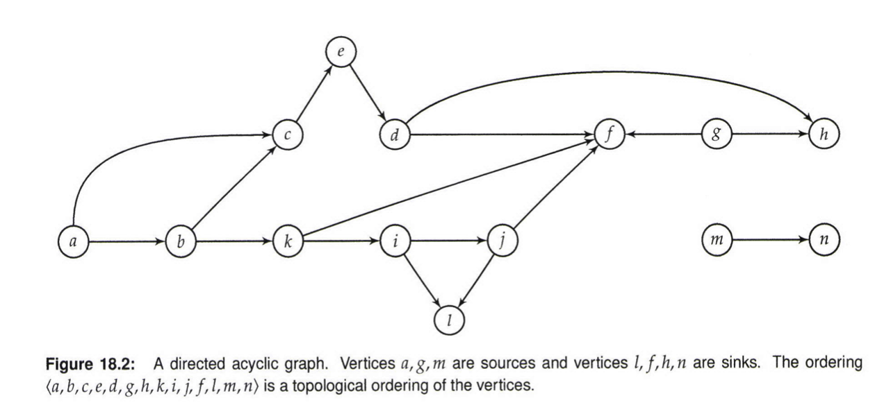

# Graphs

A graph is a set of vertices and coru:rected by edges.  
Formally, a directed graph is a set V of aertices and a set E c VxV of edges.  
Give an edge e = (u,v),the vertex 'u' is its source, and 'v' is its sink.  
Graphs are often decorated, e.g., by adding lengths to edges, weights to vertices, a start vertex, etc.   
A directed graph can be depicted pictorially as in the Figure below.

 

A path in a directed graph from u to vertex v is a sequence of vertices (Vo, V1, . . . ,Vn-1) where Vo = u, Vn-1. = V, and each (Vi, Vi+1) is an edge.   
The sequence may consist of a single vertex. The length of the path (Vo, V1, . . . ,Vn-1) is n - 1.   
Intuitively, the length of a path is the number of edges it traverses. If there exists apath from u to v, v is said to be reachablefrom u.   
For example,the sequence (a,c,e,d,h) is a path in the graph represented in Figure 18.1 below.

 
 

### Directed Acyclic Graph

A directed acyclic graph (DAG) is a directed graph in which there are no cycles, i.e., paths which contain one or more edges and which begin and end at the same vertex.   
See Figure 18.2 below for an example of a directed acyclic graph. Vertices in a DAG which have no incoming edges are referred to as sources; vertices which have no outgoing edges are referred to as sinks.   
A topological ordering of the vertices in a DAG is an ordering of the vertices in which each edge is from a vertex earlier in the ordering to a vertex later in the ordering.

 

 
 

### Undirected Graph

An undirected graph is also a tuple (V, E); however, E is a set of unordered pairs of vertices, Graphically, this is captured by drawing arrowless connections between vertices, as in Figure 18.3 below.  

If G is an undirected graph, vertices u and o are said tobe connected if G contains a path from u to v; otherwise, u and v are said to be disconnected.   
A graph is said to be connected if every pair of vertices in the graph is connected. A connected component is a maximal set of vertices C such that each pair of vertices in C is connected in G. Every vertex belongs to exactly one connected component.  

For example, the graph in Figure 18.3 is connected, and it has a single connected component. If edge (h, i) is removed, it remains connected. If additionally (f , i) is removed, it becomes disconnected
and there are two connected components.  

 

## Questions

In this section we will solve common graph questions

* [Search Maze](1_search_maze/search_maze.py)
    